# resonance_data
This page is a summary of my resonace data testing. I hope this will help others get insights in what may or may not be going on, which upgrades work etc. Have fun reading.

I am starting this and going forward. This means I am starting of with:
- Voron 2.4 r1
- flat front idlers (ABS)
- Z joint mod (ABS) with IGUS
- fairly light CF square tube (Fystec with the cut out for AB joints)
- 1x MGN12
- custom toolhead with Goliath hotend and Hextrudort extruder

**Here are some of my findings:**
- GE5C with IGUS works, more dampening
- "improved" front idler (printed) made if worse for me compared to the aluminium (cnc'ed) idlers I had
- Fystec carbon fiber tube (not ultra light, the one with about 77g) works just as well as Fystec ultra light aluminium x-beam (on my Voron 2.4 350mm)
- mount point of the ADXL for measurment makes a big difference... I am using a nozzle mount for the ADXL from now on.
- with my Voron 2.4 all panels attached makes a bit of a difference. Idealy strengthing the corners would be an option, bit it is difficult on 2.4. I am using 3 quick relase latches on each side on every panel, to get almost same effect, but keeing everything as convenient as possible. 

**The follwoing graphs are in chronological order, the top is the oldest, newest at the bottom.**

###################
BASELINE 
###################

**2023-03-17 (early in the morning, somebody should tell me, how late it is... don't I have to work later?!?)**

X

Fitted shaper 'zv' frequency = 108.0 Hz (vibrations = 29.5%, smoothing ~= 0.019) To avoid too much smoothing with 'zv', suggested max_accel <= 45500 mm/sec^2
Fitted shaper 'mzv' frequency = 69.4 Hz (vibrations = 1.5%, smoothing ~= 0.044) To avoid too much smoothing with 'mzv', suggested max_accel <= 14200 mm/sec^2
Fitted shaper 'ei' frequency = 88.6 Hz (vibrations = 4.9%, smoothing ~= 0.042) To avoid too much smoothing with 'ei', suggested max_accel <= 14600 mm/sec^2
Fitted shaper '2hump_ei' frequency = 99.6 Hz (vibrations = 0.0%, smoothing ~= 0.056) To avoid too much smoothing with '2hump_ei', suggested max_accel <= 11000 mm/sec^2
Fitted shaper '3hump_ei' frequency = 120.0 Hz (vibrations = 0.0%, smoothing ~= 0.058) To avoid too much smoothing with '3hump_ei', suggested max_accel <= 10500 mm/sec^2
Recommended shaper is mzv @ 69.4 Hz

Y

Fitted shaper 'zv' frequency = 73.2 Hz (vibrations = 15.6%, smoothing ~= 0.035) To avoid too much smoothing with 'zv', suggested max_accel <= 20900 mm/sec^2
Fitted shaper 'mzv' frequency = 50.8 Hz (vibrations = 2.8%, smoothing ~= 0.079) To avoid too much smoothing with 'mzv', suggested max_accel <= 7600 mm/sec^2
Fitted shaper 'ei' frequency = 68.8 Hz (vibrations = 1.9%, smoothing ~= 0.068) To avoid too much smoothing with 'ei', suggested max_accel <= 8800 mm/sec^2
Fitted shaper '2hump_ei' frequency = 72.4 Hz (vibrations = 0.0%, smoothing ~= 0.103) To avoid too much smoothing with '2hump_ei', suggested max_accel <= 5800 mm/sec^2
Fitted shaper '3hump_ei' frequency = 86.6 Hz (vibrations = 0.0%, smoothing ~= 0.109) To avoid too much smoothing with '3hump_ei', suggested max_accel <= 5500 mm/sec^2
Recommended shaper is ei @ 68.8 Hz

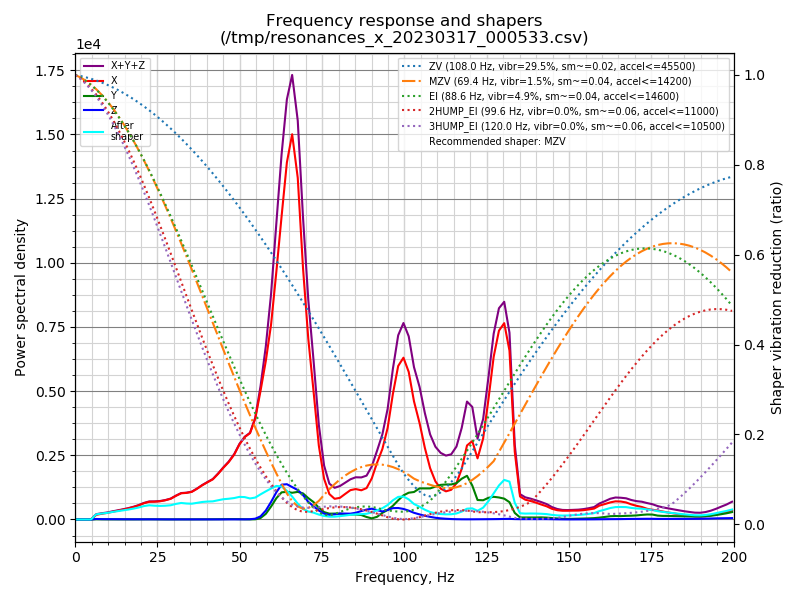
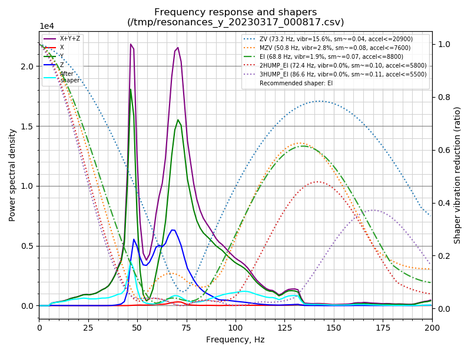

**attaching bowden into the extruder, securing one loose cable, tightening the XY belts...**

X

Fitted shaper 'zv' frequency = 83.4 Hz (vibrations = 23.9%, smoothing ~= 0.028) To avoid too much smoothing with 'zv', suggested max_accel <= 27100 mm/sec^2
Fitted shaper 'mzv' frequency = 69.0 Hz (vibrations = 0.8%, smoothing ~= 0.044) To avoid too much smoothing with 'mzv', suggested max_accel <= 14000 mm/sec^2
Fitted shaper 'ei' frequency = 86.6 Hz (vibrations = 3.5%, smoothing ~= 0.044) To avoid too much smoothing with 'ei', suggested max_accel <= 14000 mm/sec^2
Fitted shaper '2hump_ei' frequency = 100.6 Hz (vibrations = 0.0%, smoothing ~= 0.055) To avoid too much smoothing with '2hump_ei', suggested max_accel <= 11300 mm/sec^2
Fitted shaper '3hump_ei' frequency = 121.0 Hz (vibrations = 0.0%, smoothing ~= 0.057) To avoid too much smoothing with '3hump_ei', suggested max_accel <= 10700 mm/sec^2
Recommended shaper is mzv @ 69.0 Hz

Y

Fitted shaper 'zv' frequency = 70.8 Hz (vibrations = 12.0%, smoothing ~= 0.037) To avoid too much smoothing with 'zv', suggested max_accel <= 19500 mm/sec^2
Fitted shaper 'mzv' frequency = 49.2 Hz (vibrations = 3.0%, smoothing ~= 0.084) To avoid too much smoothing with 'mzv', suggested max_accel <= 7100 mm/sec^2
Fitted shaper 'ei' frequency = 65.8 Hz (vibrations = 0.5%, smoothing ~= 0.074) To avoid too much smoothing with 'ei', suggested max_accel <= 8100 mm/sec^2
Fitted shaper '2hump_ei' frequency = 76.8 Hz (vibrations = 0.0%, smoothing ~= 0.091) To avoid too much smoothing with '2hump_ei', suggested max_accel <= 6600 mm/sec^2
Fitted shaper '3hump_ei' frequency = 93.2 Hz (vibrations = 0.0%, smoothing ~= 0.094) To avoid too much smoothing with '3hump_ei', suggested max_accel <= 6400 mm/sec^2
Recommended shaper is ei @ 65.8 Hz

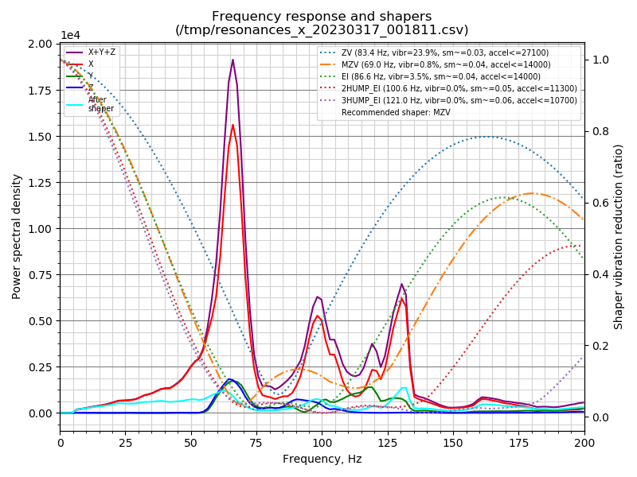
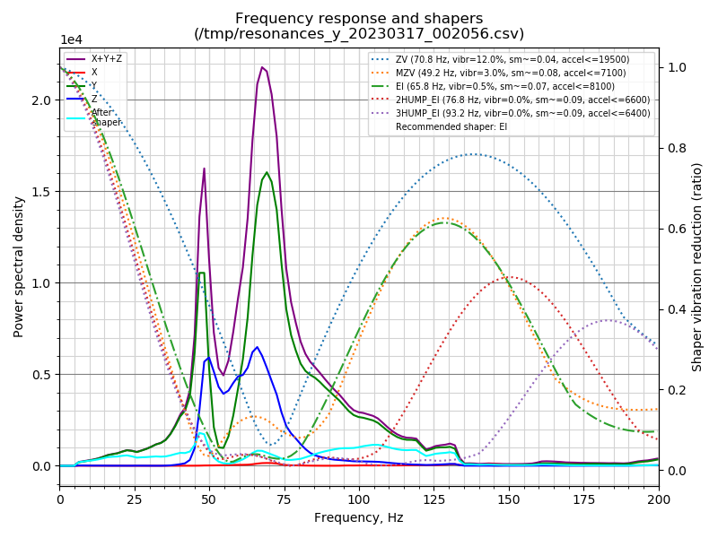

###################
END - BASELINE 
###################

At this point I am somewhat disappointed and determined to find the cause for my ugly graphs.

**“downgrade” / rollback from flat front IDLERs (ABS) to “thick” aluminium cnc default front idlers, which I bought of AliExpress**

X

Fitted shaper 'zv' frequency = 114.2 Hz (vibrations = 28.7%, smoothing ~= 0.017) To avoid too much smoothing with 'zv', suggested max_accel <= 50800 mm/sec^2
Fitted shaper 'mzv' frequency = 72.6 Hz (vibrations = 1.3%, smoothing ~= 0.040) To avoid too much smoothing with 'mzv', suggested max_accel <= 15500 mm/sec^2
Fitted shaper 'ei' frequency = 94.6 Hz (vibrations = 5.2%, smoothing ~= 0.037) To avoid too much smoothing with 'ei', suggested max_accel <= 16700 mm/sec^2
Fitted shaper '2hump_ei' frequency = 104.6 Hz (vibrations = 0.0%, smoothing ~= 0.051) To avoid too much smoothing with '2hump_ei', suggested max_accel <= 12200 mm/sec^2
Fitted shaper '3hump_ei' frequency = 125.6 Hz (vibrations = 0.0%, smoothing ~= 0.054) To avoid too much smoothing with '3hump_ei', suggested max_accel <= 11500 mm/sec^2
Recommended shaper is mzv @ 72.6 Hz

Y
Fitted shaper 'zv' frequency = 81.8 Hz (vibrations = 15.7%, smoothing ~= 0.029) To avoid too much smoothing with 'zv', suggested max_accel <= 26100 mm/sec^2
Fitted shaper 'mzv' frequency = 71.6 Hz (vibrations = 2.4%, smoothing ~= 0.041) To avoid too much smoothing with 'mzv', suggested max_accel <= 15100 mm/sec^2
Fitted shaper 'ei' frequency = 80.8 Hz (vibrations = 0.5%, smoothing ~= 0.049) To avoid too much smoothing with 'ei', suggested max_accel <= 12200 mm/sec^2
Fitted shaper '2hump_ei' frequency = 79.8 Hz (vibrations = 0.0%, smoothing ~= 0.085) To avoid too much smoothing with '2hump_ei', suggested max_accel <= 7100 mm/sec^2
Fitted shaper '3hump_ei' frequency = 99.6 Hz (vibrations = 0.0%, smoothing ~= 0.083) To avoid too much smoothing with '3hump_ei', suggested max_accel <= 7300 mm/sec^2
Recommended shaper is ei @ 80.8 Hz

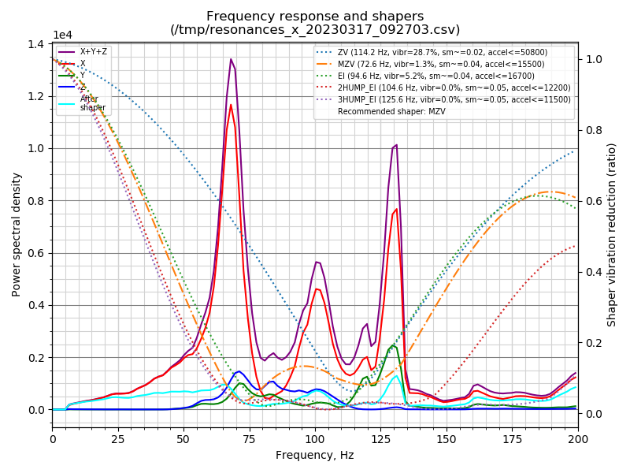
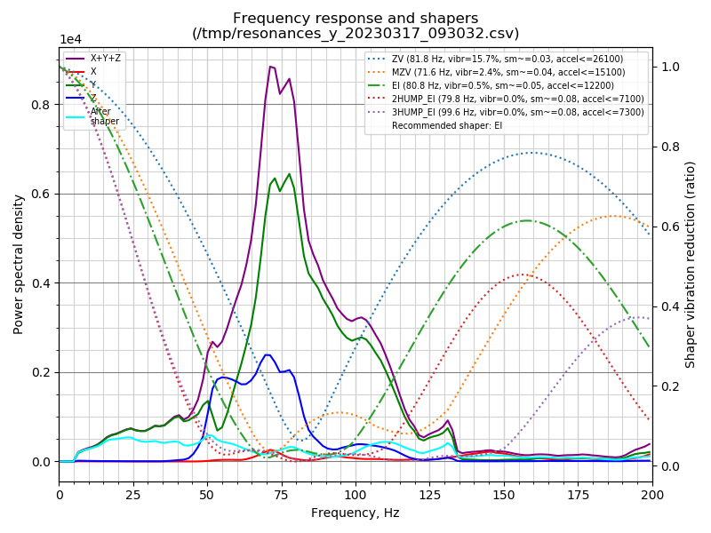

**“downgrade” / rollback from Z joints GE5C with IGUS to aluminium CNC’ed default Voron 2.4r1 Z joints**

X

Fitted shaper 'zv' frequency = 98.0 Hz (vibrations = 13.6%, smoothing ~= 0.022) To avoid too much smoothing with 'zv', suggested max_accel <= 37400 mm/sec^2
Fitted shaper 'mzv' frequency = 91.2 Hz (vibrations = 3.9%, smoothing ~= 0.027) To avoid too much smoothing with 'mzv', suggested max_accel <= 24500 mm/sec^2
Fitted shaper 'ei' frequency = 99.2 Hz (vibrations = 2.3%, smoothing ~= 0.035) To avoid too much smoothing with 'ei', suggested max_accel <= 18300 mm/sec^2
Fitted shaper '2hump_ei' frequency = 102.4 Hz (vibrations = 0.0%, smoothing ~= 0.053) To avoid too much smoothing with '2hump_ei', suggested max_accel <= 11700 mm/sec^2
Fitted shaper '3hump_ei' frequency = 124.6 Hz (vibrations = 0.0%, smoothing ~= 0.055) To avoid too much smoothing with '3hump_ei', suggested max_accel <= 11400 mm/sec^2
Recommended shaper is 2hump_ei @ 102.4 Hz

Y

Fitted shaper 'zv' frequency = 72.6 Hz (vibrations = 4.4%, smoothing ~= 0.036) To avoid too much smoothing with 'zv', suggested max_accel <= 20500 mm/sec^2
Fitted shaper 'mzv' frequency = 46.0 Hz (vibrations = 1.5%, smoothing ~= 0.096) To avoid too much smoothing with 'mzv', suggested max_accel <= 6200 mm/sec^2
Fitted shaper 'ei' frequency = 67.8 Hz (vibrations = 0.0%, smoothing ~= 0.070) To avoid too much smoothing with 'ei', suggested max_accel <= 8600 mm/sec^2
Fitted shaper '2hump_ei' frequency = 86.0 Hz (vibrations = 0.0%, smoothing ~= 0.073) To avoid too much smoothing with '2hump_ei', suggested max_accel <= 8200 mm/sec^2
Fitted shaper '3hump_ei' frequency = 105.4 Hz (vibrations = 0.0%, smoothing ~= 0.074) To avoid too much smoothing with '3hump_ei', suggested max_accel <= 8100 mm/sec^2
Recommended shaper is ei @ 67.8 Hz

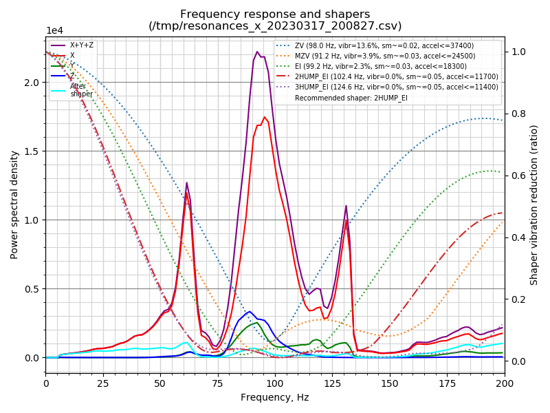
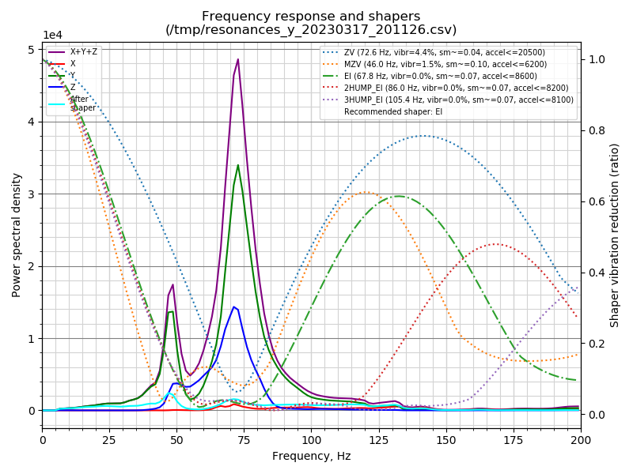

**IGUS Z joins seem to be better, vibration dampening!**

**Switching from Feystec CF square tube with ABS printed AB joints to fystec (gen 1) ultra light aluminium x-beam with light weight aluminium AB joints**

X

Fitted shaper 'zv' frequency = 124.0 Hz (vibrations = 10.9%, smoothing ~= 0.015) To avoid too much smoothing with 'zv', suggested max_accel <= 59900 mm/sec^2
Fitted shaper 'mzv' frequency = 78.0 Hz (vibrations = 1.5%, smoothing ~= 0.036) To avoid too much smoothing with 'mzv', suggested max_accel <= 17900 mm/sec^2
Fitted shaper 'ei' frequency = 107.4 Hz (vibrations = 1.0%, smoothing ~= 0.030) To avoid too much smoothing with 'ei', suggested max_accel <= 21500 mm/sec^2
Fitted shaper '2hump_ei' frequency = 114.6 Hz (vibrations = 0.0%, smoothing ~= 0.044) To avoid too much smoothing with '2hump_ei', suggested max_accel <= 14600 mm/sec^2
Fitted shaper '3hump_ei' frequency = 140.4 Hz (vibrations = 0.0%, smoothing ~= 0.044) To avoid too much smoothing with '3hump_ei', suggested max_accel <= 14400 mm/sec^2
Recommended shaper is ei @ 107.4 Hz
Y

Fitted shaper 'zv' frequency = 91.6 Hz (vibrations = 19.0%, smoothing ~= 0.024) To avoid too much smoothing with 'zv', suggested max_accel <= 32700 mm/sec^2
Fitted shaper 'mzv' frequency = 59.4 Hz (vibrations = 1.2%, smoothing ~= 0.058) To avoid too much smoothing with 'mzv', suggested max_accel <= 10400 mm/sec^2
Fitted shaper 'ei' frequency = 80.2 Hz (vibrations = 1.6%, smoothing ~= 0.050) To avoid too much smoothing with 'ei', suggested max_accel <= 12000 mm/sec^2
Fitted shaper '2hump_ei' frequency = 89.0 Hz (vibrations = 0.0%, smoothing ~= 0.068) To avoid too much smoothing with '2hump_ei', suggested max_accel <= 8800 mm/sec^2
Fitted shaper '3hump_ei' frequency = 108.6 Hz (vibrations = 0.0%, smoothing ~= 0.070) To avoid too much smoothing with '3hump_ei', suggested max_accel <= 8600 mm/sec^2
Recommended shaper is ei @ 80.2 Hz
**CF vs fairly light aluminum x-beam does not seem to make much of a difference**

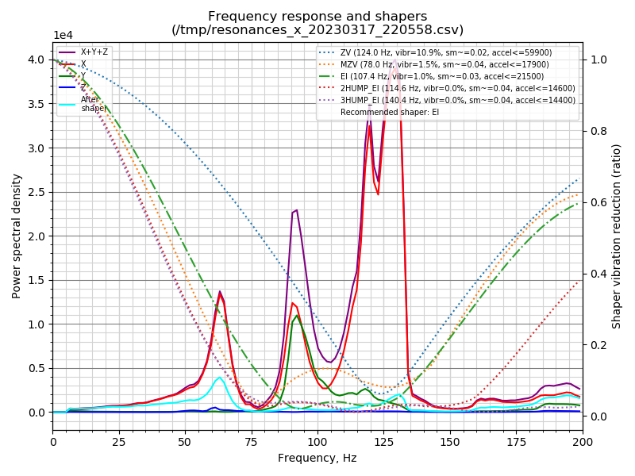
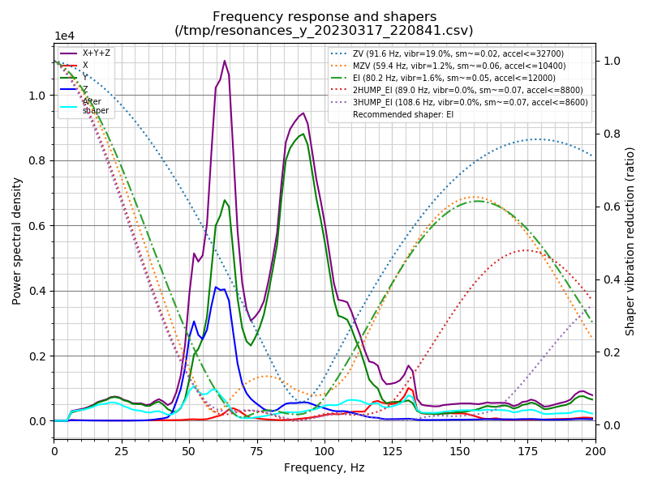

**installed the z-joint IGUS mod again (replacing the aluminium CNC’ed z-joint)**

X

Fitted shaper 'zv' frequency = 126.0 Hz (vibrations = 21.0%, smoothing ~= 0.015) To avoid too much smoothing with 'zv', suggested max_accel <= 61900 mm/sec^2
Fitted shaper 'mzv' frequency = 75.8 Hz (vibrations = 1.8%, smoothing ~= 0.037) To avoid too much smoothing with 'mzv', suggested max_accel <= 16900 mm/sec^2
Fitted shaper 'ei' frequency = 104.8 Hz (vibrations = 4.4%, smoothing ~= 0.032) To avoid too much smoothing with 'ei', suggested max_accel <= 20500 mm/sec^2
Fitted shaper '2hump_ei' frequency = 107.8 Hz (vibrations = 0.0%, smoothing ~= 0.049) to avoid too much smoothing with '2hump_ei', suggested max_accel <= 12900 mm/sec^2
Fitted shaper '3hump_ei' frequency = 130.8 Hz (vibrations = 0.0%, smoothing ~= 0.050) To avoid too much smoothing with '3hump_ei', suggested max_accel <= 12500 mm/sec^2
Recommended shaper is 2hump_ei @ 107.8 Hz

Y

Fitted shaper 'zv' frequency = 84.4 Hz (vibrations = 19.8%, smoothing ~= 0.028) To avoid too much smoothing with 'zv', suggested max_accel <= 27800 mm/sec^2
Fitted shaper 'mzv' frequency = 60.2 Hz (vibrations = 1.9%, smoothing ~= 0.056) To avoid too much smoothing with 'mzv', suggested max_accel <= 10700 mm/sec^2
Fitted shaper 'ei' frequency = 76.6 Hz (vibrations = 1.6%, smoothing ~= 0.055) To avoid too much smoothing with 'ei', suggested max_accel <= 10900 mm/sec^2
Fitted shaper '2hump_ei' frequency = 86.6 Hz (vibrations = 0.0%, smoothing ~= 0.072) To avoid too much smoothing with '2hump_ei', suggested max_accel <= 8300 mm/sec^2
Fitted shaper '3hump_ei' frequency = 105.4 Hz (vibrations = 0.0%, smoothing ~= 0.074) To avoid too much smoothing with '3hump_ei', suggested max_accel <= 8100 mm/sec^2
Recommended shaper is 2hump_ei @ 86.6 Hz

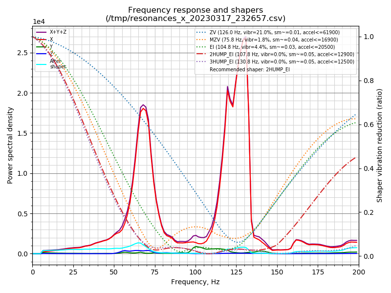
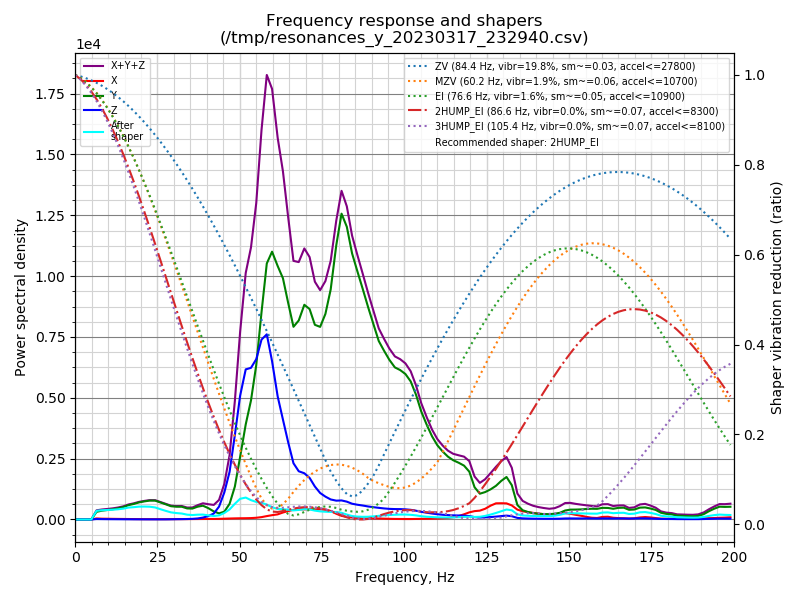

**tightened AB belts >>> IGUS-z-joints, Fystec ultra light X-beam on light cnc’ed aluminium AB joints and front idlers, CPAP & beacon toolhead**

###########################
NEW - BASELINE
###########################

X

Fitted shaper 'zv' frequency = 123.0 Hz (vibrations = 16.1%, smoothing ~= 0.015)To avoid too much smoothing with 'zv', suggested max_accel <= 59000 mm/sec^2
Fitted shaper 'mzv' frequency = 76.2 Hz (vibrations = 1.9%, smoothing ~= 0.037)To avoid too much smoothing with 'mzv', suggested max_accel <= 17100 mm/sec^2
Fitted shaper 'ei' frequency = 105.4 Hz (vibrations = 2.9%, smoothing ~= 0.031)To avoid too much smoothing with 'ei', suggested max_accel <= 20700 mm/sec^2
Fitted shaper '2hump_ei' frequency = 111.4 Hz (vibrations = 0.0%, smoothing ~= 0.046)To avoid too much smoothing with '2hump_ei', suggested max_accel <= 13800 mm/sec^2
Fitted shaper '3hump_ei' frequency = 135.4 Hz (vibrations = 0.0%, smoothing ~= 0.047)To avoid too much smoothing with '3hump_ei', suggested max_accel <= 13400 mm/sec^2
Recommended shaper is 2hump_ei @ 111.4 Hz

Y

Fitted shaper 'zv' frequency = 89.0 Hz (vibrations = 20.1%, smoothing ~= 0.026)To avoid too much smoothing with 'zv', suggested max_accel <= 30900 mm/sec^2
Fitted shaper 'mzv' frequency = 57.8 Hz (vibrations = 0.7%, smoothing ~= 0.061)To avoid too much smoothing with 'mzv', suggested max_accel <= 9800 mm/sec^2
Fitted shaper 'ei' frequency = 78.4 Hz (vibrations = 1.9%, smoothing ~= 0.052)To avoid too much smoothing with 'ei', suggested max_accel <= 11400 mm/sec^2
Fitted shaper '2hump_ei' frequency = 87.4 Hz (vibrations = 0.0%, smoothing ~= 0.071)To avoid too much smoothing with '2hump_ei', suggested max_accel <= 8500 mm/sec^2
Fitted shaper '3hump_ei' frequency = 106.4 Hz (vibrations = 0.0%, smoothing ~= 0.072)To avoid too much smoothing with '3hump_ei', suggested max_accel <= 8300 mm/sec^2
Recommended shaper is mzv @ 57.8 Hz

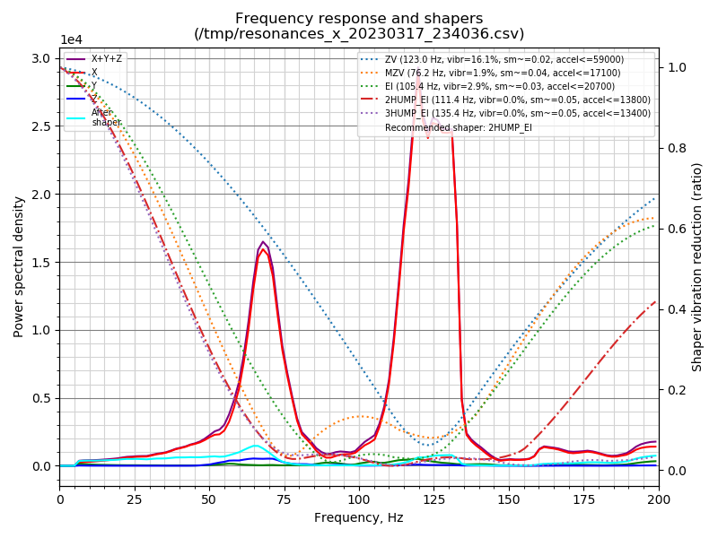
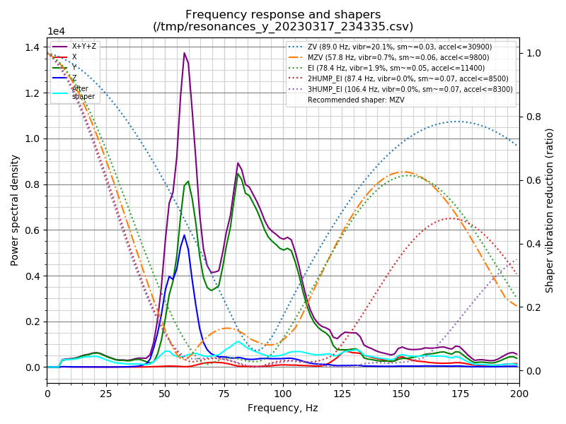

#############################
END - NEW BASELINE
#############################

**new Toolhead I designed, 3mm pulled in CG by moving hotend and extruder in 3mm, ADXL location in the middle with the CPAP clamp, not the Nozzle mount!**

X

Fitted shaper 'zv' frequency = 66.6 Hz (vibrations = 6.4%, smoothing ~= 0.041) To avoid too much smoothing with 'zv', suggested max_accel <= 17300 mm/sec^2
Fitted shaper 'mzv' frequency = 43.2 Hz (vibrations = 1.4%, smoothing ~= 0.109) To avoid too much smoothing with 'mzv', suggested max_accel <= 5500 mm/sec^2
Fitted shaper 'ei' frequency = 58.8 Hz (vibrations = 0.0%, smoothing ~= 0.093) To avoid too much smoothing with 'ei', suggested max_accel <= 6400 mm/sec^2
Fitted shaper '2hump_ei' frequency = 92.4 Hz (vibrations = 0.0%, smoothing ~= 0.064) To avoid too much smoothing with '2hump_ei', suggested max_accel <= 9500 mm/sec^2
Fitted shaper '3hump_ei' frequency = 114.4 Hz (vibrations = 0.0%, smoothing ~= 0.063) To avoid too much smoothing with '3hump_ei', suggested max_accel <= 9600 mm/sec^2
Recommended shaper is 2hump_ei @ 92.4 Hz

Y

Fitted shaper 'zv' frequency = 63.8 Hz (vibrations = 14.4%, smoothing ~= 0.045) To avoid too much smoothing with 'zv', suggested max_accel <= 15900 mm/sec^2
Fitted shaper 'mzv' frequency = 47.2 Hz (vibrations = 0.4%, smoothing ~= 0.091) To avoid too much smoothing with 'mzv', suggested max_accel <= 6600 mm/sec^2
Fitted shaper 'ei' frequency = 60.4 Hz (vibrations = 0.0%, smoothing ~= 0.088) To avoid too much smoothing with 'ei', suggested max_accel <= 6800 mm/sec^2
Fitted shaper '2hump_ei' frequency = 75.4 Hz (vibrations = 0.0%, smoothing ~= 0.095) To avoid too much smoothing with '2hump_ei', suggested max_accel <= 6300 mm/sec^2
Fitted shaper '3hump_ei' frequency = 90.2 Hz (vibrations = 0.0%, smoothing ~= 0.101) To avoid too much smoothing with '3hump_ei', suggested max_accel <= 6000 mm/sec^2
Recommended shaper is mzv @ 47.2 Hz

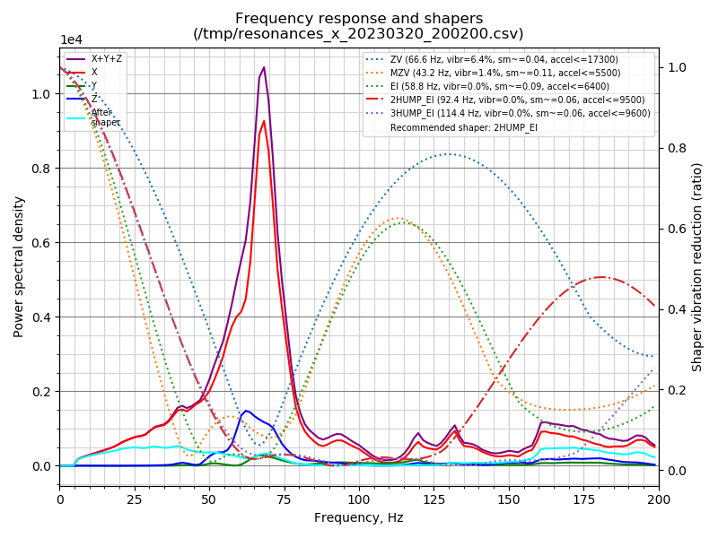
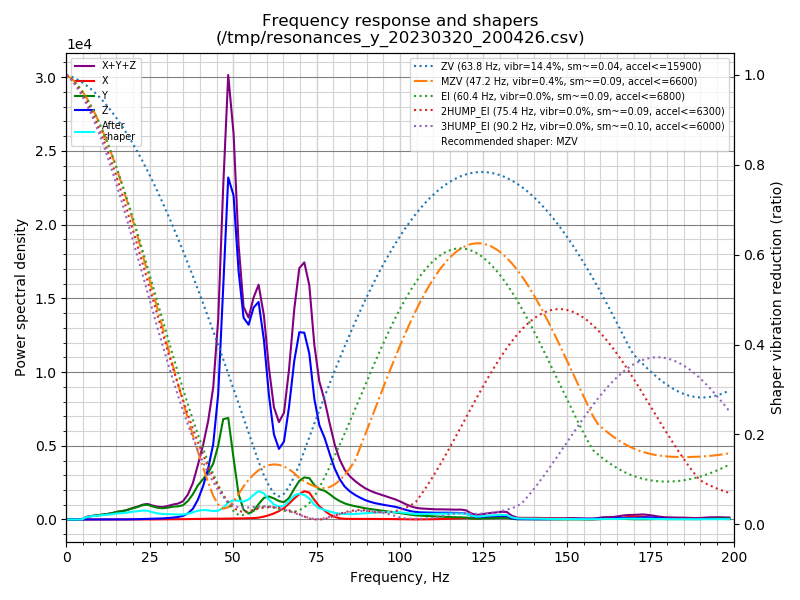

**tighter belts…. as before >> new Toolhead, 3mm pulled in CG, ADXL location in the middle with the CPAP clamp, not the Nozzle mount**

X

Fitted shaper 'zv' frequency = 69.6 Hz (vibrations = 29.8%, smoothing ~= 0.038) To avoid too much smoothing with 'zv', suggested max_accel <= 18900 mm/sec^2
Fitted shaper 'mzv' frequency = 43.2 Hz (vibrations = 6.2%, smoothing ~= 0.109) To avoid too much smoothing with 'mzv', suggested max_accel <= 5500 mm/sec^2
Fitted shaper 'ei' frequency = 59.6 Hz (vibrations = 8.0%, smoothing ~= 0.091) To avoid too much smoothing with 'ei', suggested max_accel <= 6600 mm/sec^2
Fitted shaper '2hump_ei' frequency = 56.6 Hz (vibrations = 2.7%, smoothing ~= 0.168) To avoid too much smoothing with '2hump_ei', suggested max_accel <= 3600 mm/sec^2
Fitted shaper '3hump_ei' frequency = 51.0 Hz (vibrations = 0.9%, smoothing ~= 0.315) To avoid too much smoothing with '3hump_ei', suggested max_accel <= 1800 mm/sec^2
Recommended shaper is 2hump_ei @ 56.6 Hz

Y

Fitted shaper 'zv' frequency = 66.0 Hz (vibrations = 14.6%, smoothing ~= 0.042) To avoid too much smoothing with 'zv', suggested max_accel <= 17000 mm/sec^2
Fitted shaper 'mzv' frequency = 49.6 Hz (vibrations = 1.0%, smoothing ~= 0.083) To avoid too much smoothing with 'mzv', suggested max_accel <= 7200 mm/sec^2
Fitted shaper 'ei' frequency = 60.8 Hz (vibrations = 0.0%, smoothing ~= 0.087) To avoid too much smoothing with 'ei', suggested max_accel <= 6900 mm/sec^2
Fitted shaper '2hump_ei' frequency = 75.4 Hz (vibrations = 0.0%, smoothing ~= 0.095) To avoid too much smoothing with '2hump_ei', suggested max_accel <= 6300 mm/sec^2
Fitted shaper '3hump_ei' frequency = 90.2 Hz (vibrations = 0.0%, smoothing ~= 0.101) To avoid too much smoothing with '3hump_ei', suggested max_accel <= 6000 mm/sec^2
Recommended shaper is ei @ 60.8 Hz

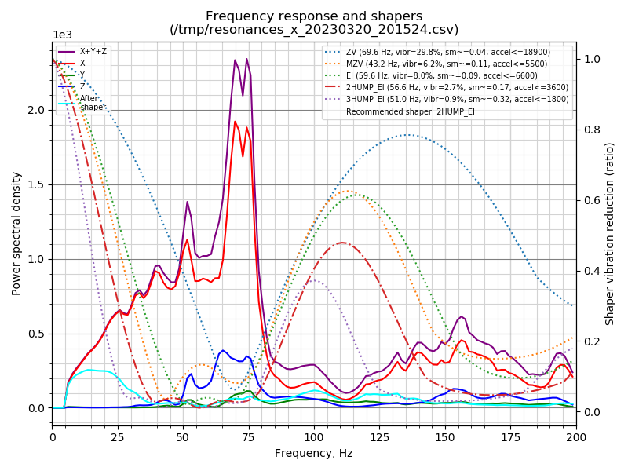
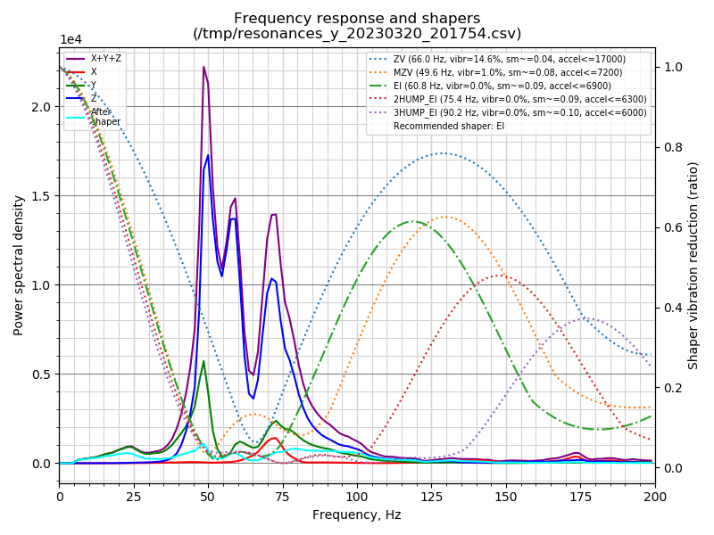

- secured the duct with screws on the bottom
- secured CPAP tube a bit more
- placed Bowden tube in the extruder

X

Fitted shaper 'zv' frequency = 67.8 Hz (vibrations = 12.5%, smoothing ~= 0.040) To avoid too much smoothing with 'zv', suggested max_accel <= 17900 mm/sec^2
Fitted shaper 'mzv' frequency = 45.2 Hz (vibrations = 1.8%, smoothing ~= 0.100) To avoid too much smoothing with 'mzv', suggested max_accel <= 6000 mm/sec^2
Fitted shaper 'ei' frequency = 61.4 Hz (vibrations = 0.3%, smoothing ~= 0.085) To avoid too much smoothing with 'ei', suggested max_accel <= 7000 mm/sec^2
Fitted shaper '2hump_ei' frequency = 61.2 Hz (vibrations = 0.0%, smoothing ~= 0.144) To avoid too much smoothing with '2hump_ei', suggested max_accel <= 4200 mm/sec^2
Fitted shaper '3hump_ei' frequency = 95.6 Hz (vibrations = 0.0%, smoothing ~= 0.090) To avoid too much smoothing with '3hump_ei', suggested max_accel <= 6700 mm/sec^2
Recommended shaper is ei @ 61.4 Hz

Y

Fitted shaper 'zv' frequency = 69.0 Hz (vibrations = 16.8%, smoothing ~= 0.039) To avoid too much smoothing with 'zv', suggested max_accel <= 18600 mm/sec^2
Fitted shaper 'mzv' frequency = 47.6 Hz (vibrations = 1.5%, smoothing ~= 0.090) To avoid too much smoothing with 'mzv', suggested max_accel <= 6700 mm/sec^2
Fitted shaper 'ei' frequency = 59.4 Hz (vibrations = 0.0%, smoothing ~= 0.091) To avoid too much smoothing with 'ei', suggested max_accel <= 6600 mm/sec^2
Fitted shaper '2hump_ei' frequency = 74.4 Hz (vibrations = 0.0%, smoothing ~= 0.097) To avoid too much smoothing with '2hump_ei', suggested max_accel <= 6200 mm/sec^2
Fitted shaper '3hump_ei' frequency = 90.0 Hz (vibrations = 0.0%, smoothing ~= 0.101) To avoid too much smoothing with '3hump_ei', suggested max_accel <= 5900 mm/sec^2
Recommended shaper is ei @ 59.4 Hz

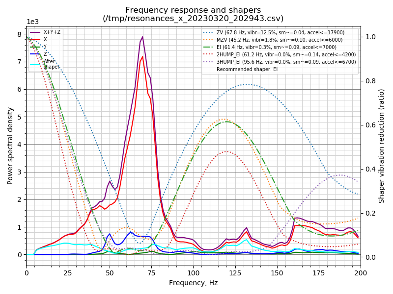
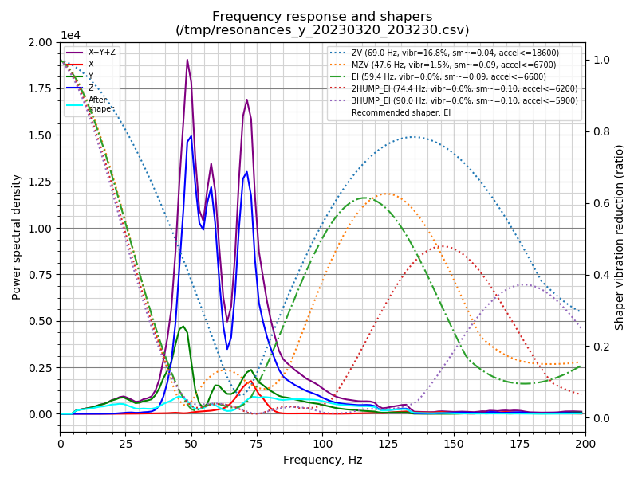

**tightened Z belts (feels like a lot)**

X

Fitted shaper 'zv' frequency = 69.4 Hz (vibrations = 17.7%, smoothing ~= 0.039) To avoid too much smoothing with 'zv', suggested max_accel <= 18800 mm/sec^2
Fitted shaper 'mzv' frequency = 44.8 Hz (vibrations = 1.9%, smoothing ~= 0.101) To avoid too much smoothing with 'mzv', suggested max_accel <= 5900 mm/sec^2
Fitted shaper 'ei' frequency = 62.8 Hz (vibrations = 2.0%, smoothing ~= 0.082) To avoid too much smoothing with 'ei', suggested max_accel <= 7300 mm/sec^2
Fitted shaper '2hump_ei' frequency = 60.2 Hz (vibrations = 0.0%, smoothing ~= 0.149) To avoid too much smoothing with '2hump_ei', suggested max_accel <= 4000 mm/sec^2
Fitted shaper '3hump_ei' frequency = 73.2 Hz (vibrations = 0.0%, smoothing ~= 0.153) To avoid too much smoothing with '3hump_ei', suggested max_accel <= 3900 mm/sec^2
Recommended shaper is ei @ 62.8 Hz

Y

Fitted shaper 'zv' frequency = 65.6 Hz (vibrations = 16.1%, smoothing ~= 0.042) To avoid too much smoothing with 'zv', suggested max_accel <= 16800 mm/sec^2
Fitted shaper 'mzv' frequency = 50.2 Hz (vibrations = 0.9%, smoothing ~= 0.081) To avoid too much smoothing with 'mzv', suggested max_accel <= 7400 mm/sec^2
Fitted shaper 'ei' frequency = 60.0 Hz (vibrations = 0.0%, smoothing ~= 0.089) To avoid too much smoothing with 'ei', suggested max_accel <= 6700 mm/sec^2
Fitted shaper '2hump_ei' frequency = 75.0 Hz (vibrations = 0.0%, smoothing ~= 0.096) To avoid too much smoothing with '2hump_ei', suggested max_accel <= 6300 mm/sec^2
Fitted shaper '3hump_ei' frequency = 90.2 Hz (vibrations = 0.0%, smoothing ~= 0.101) To avoid too much smoothing with '3hump_ei', suggested max_accel <= 6000 mm/sec^2
Recommended shaper is mzv @ 50.2 Hz

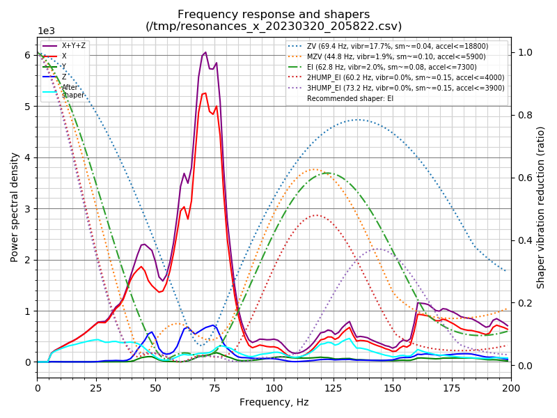
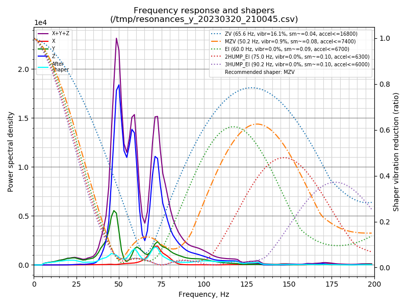

**using a nozzle mount for the ADXL instead of the one mounted in the toolhead**

X

Fitted shaper 'zv' frequency = 69.6 Hz (vibrations = 23.9%, smoothing ~= 0.038) To avoid too much smoothing with 'zv', suggested max_accel <= 18900 mm/sec^2
Fitted shaper 'mzv' frequency = 67.0 Hz (vibrations = 8.1%, smoothing ~= 0.046) To avoid too much smoothing with 'mzv', suggested max_accel <= 13200 mm/sec^2
Fitted shaper 'ei' frequency = 84.0 Hz (vibrations = 9.9%, smoothing ~= 0.046) To avoid too much smoothing with 'ei', suggested max_accel <= 13100 mm/sec^2
Fitted shaper '2hump_ei' frequency = 85.0 Hz (vibrations = 2.2%, smoothing ~= 0.075) To avoid too much smoothing with '2hump_ei', suggested max_accel <= 8000 mm/sec^2
Fitted shaper '3hump_ei' frequency = 49.8 Hz (vibrations = 0.0%, smoothing ~= 0.330) To avoid too much smoothing with '3hump_ei', suggested max_accel <= 1700 mm/sec^2
Recommended shaper is 2hump_ei @ 85.0 Hz

Y

Fitted shaper 'zv' frequency = 70.8 Hz (vibrations = 5.7%, smoothing ~= 0.037) To avoid too much smoothing with 'zv', suggested max_accel <= 19500 mm/sec^2
Fitted shaper 'mzv' frequency = 66.0 Hz (vibrations = 1.2%, smoothing ~= 0.048) To avoid too much smoothing with 'mzv', suggested max_accel <= 12800 mm/sec^2
Fitted shaper 'ei' frequency = 75.0 Hz (vibrations = 0.0%, smoothing ~= 0.057) To avoid too much smoothing with 'ei', suggested max_accel <= 10500 mm/sec^2
Fitted shaper '2hump_ei' frequency = 95.6 Hz (vibrations = 0.0%, smoothing ~= 0.060) To avoid too much smoothing with '2hump_ei', suggested max_accel <= 10200 mm/sec^2
Fitted shaper '3hump_ei' frequency = 117.6 Hz (vibrations = 0.0%, smoothing ~= 0.060) To avoid too much smoothing with '3hump_ei', suggested max_accel <= 10100 mm/sec^2
Recommended shaper is mzv @ 66.0 Hz

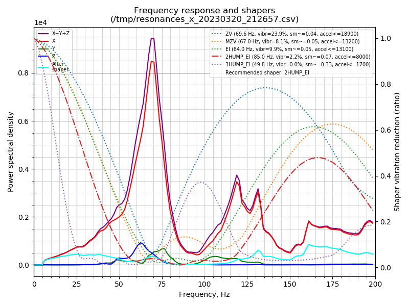
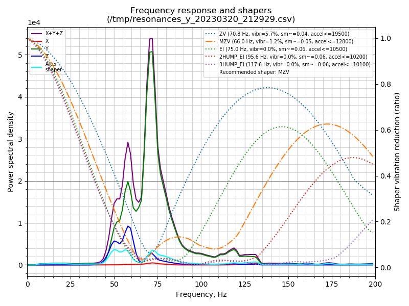

**increased run current from 1.0 to 1.4**

X

Fitted shaper 'zv' frequency = 118.8 Hz (vibrations = 22.7%, smoothing ~= 0.016)To avoid too much smoothing with 'zv', suggested max_accel <= 55000 mm/sec^2
Fitted shaper 'mzv' frequency = 73.0 Hz (vibrations = 0.5%, smoothing ~= 0.040)To avoid too much smoothing with 'mzv', suggested max_accel <= 15700 mm/sec^2
Fitted shaper 'ei' frequency = 98.0 Hz (vibrations = 3.2%, smoothing ~= 0.035)To avoid too much smoothing with 'ei', suggested max_accel <= 17900 mm/sec^2
Fitted shaper '2hump_ei' frequency = 107.2 Hz (vibrations = 0.0%, smoothing ~= 0.049)To avoid too much smoothing with '2hump_ei', suggested max_accel <= 12800 mm/sec^2
Fitted shaper '3hump_ei' frequency = 131.0 Hz (vibrations = 0.0%, smoothing ~= 0.050)To avoid too much smoothing with '3hump_ei', suggested max_accel <= 12600 mm/sec^2
Recommended shaper is mzv @ 73.0 Hz

Y

Fitted shaper 'zv' frequency = 72.6 Hz (vibrations = 4.2%, smoothing ~= 0.036)To avoid too much smoothing with 'zv', suggested max_accel <= 20500 mm/sec^2
Fitted shaper 'mzv' frequency = 68.0 Hz (vibrations = 0.3%, smoothing ~= 0.045)To avoid too much smoothing with 'mzv', suggested max_accel <= 13600 mm/sec^2
Fitted shaper 'ei' frequency = 79.6 Hz (vibrations = 0.0%, smoothing ~= 0.051)To avoid too much smoothing with 'ei', suggested max_accel <= 11800 mm/sec^2
Fitted shaper '2hump_ei' frequency = 102.0 Hz (vibrations = 0.0%, smoothing ~= 0.054)To avoid too much smoothing with '2hump_ei', suggested max_accel <= 11600 mm/sec^2
Fitted shaper '3hump_ei' frequency = 125.6 Hz (vibrations = 0.0%, smoothing ~= 0.054)To avoid too much smoothing with '3hump_ei', suggested max_accel <= 11500 mm/sec^2
Recommended shaper is mzv @ 68.0 Hz

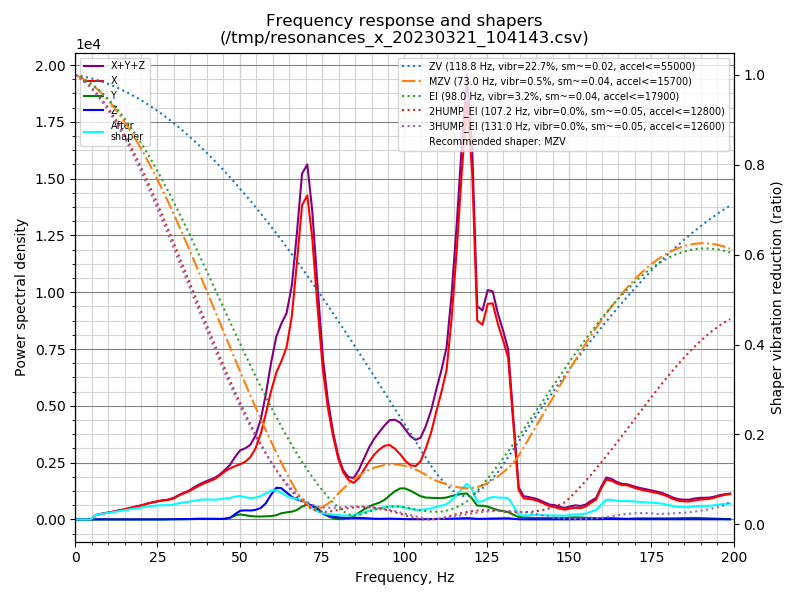
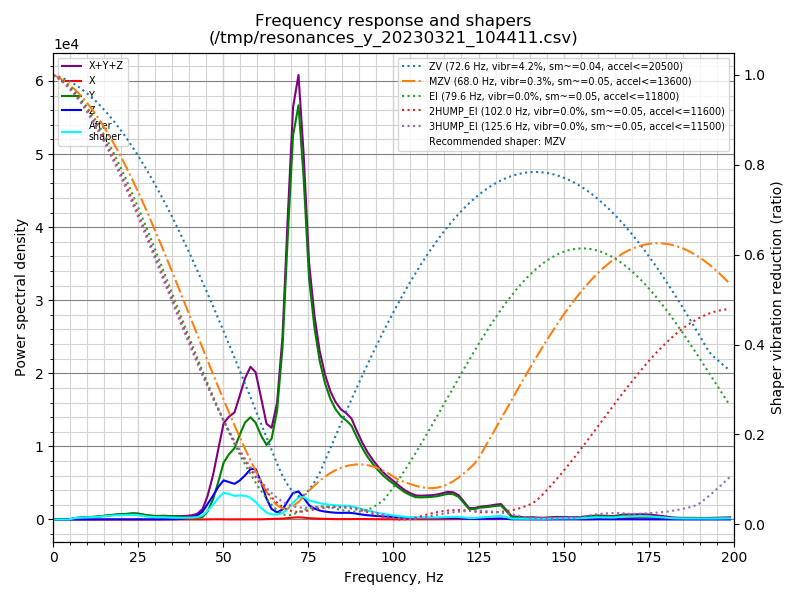

